# 基于at89c51的猜数字小游戏

```markdown
@author:q
实验环境:keil5,proteus 8.6
项目git位置:https://github.com/9cij/c51
```

## 游戏流程
​	电脑随机产生一个数字,玩家输入,如果大了,就输出大了,如果小了,就输出小了,然后继续猜,直到猜对为止.

​	按下enter键,游戏开始

​	按加减键修改数字,切换用来控制修改十位数或是个位数

​	按下enter提交输入,猜错会提示大了或者小了,可以继续猜

​	对了会提示win

​	win之后等5s会自动返回首页,也可以随时通过restart返回首页

​	

## 设计思路
### 首先需要有三个页面

​	首页,显示游戏的名字(guess num game)和基本信息(随机值产生的范围,1到100的左闭右闭区间),响应游戏开始的按键

​	游戏开始的页面,第一行为input u guess num,当点击确认时,第一行会变成提示(big,small,win),第二行为用户的输入值,每次对输入值的修改,都会实时显示到第二行

​	游戏胜利的界面(只能胜利或者重置),第一行固定(you win),第二行显示用户尝试的次数,该页面等待5s后会自动返回首页

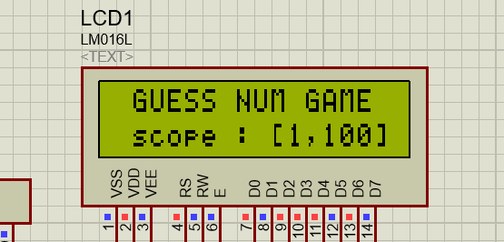

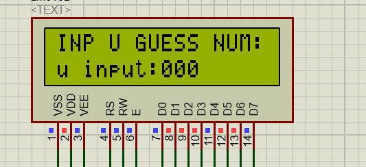

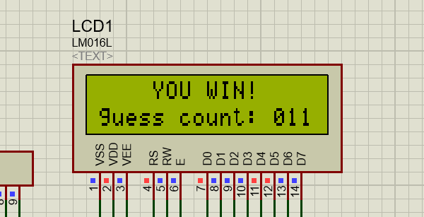

### 然后需要调节数字的五个按键
​	按键一:加

​	按键二:减

​	按键三:切换修改的位数,初始为个位,点击一次则会切到十位,思路来自于可调时钟,十位数的调节直接+10或-10即可

​	按键四:start/commit 第一次点击是告诉程序,可以开始游戏了,第二次是提交所猜测的数字

​	按键五:restart 随时都能点击,重置游戏状态,回到首页

### 程序逻辑

1.初始化,程序通电,初始化液晶显示器,简易的锁逻辑,一些必要的全局变量

2.获取一个随机值

3.进入首页

4.开始监听按键事件

​	4.1监听enter键

​		4.1.1第一次按下enter的时候,才会进入游戏,第二次是提交输入,所以这里有个enter_flag来记录当前是第几次按下,第一次按下后,enter_flag自增,然后进入到游戏页

​		4.1.2然后显示用户输入的值在显示器第二行,初始值是0

​		4.1.3将key设为1(unlock),key的初值是0,监听按键事件中,仅当key非0的时候才会监听(响应)切换和加减按键

​	4.2第一次按下enter后,key=1,就解锁了,所以程序开始监听k2(切换)键

​		4.2.1key=1时,程序可以对个位数进行加减操作,按下k2(切换键),开始操作十位数

​		4.2.2程序在每次操作个位数和十位数后,都会直接展示出来

​	4.3程序再次按下enter键,enter_flag自增,变成2

​		4.3.1guess_count++记录提交次数

​		4.3.2开始对比用户输入和系统产生的随机值

​			4.3.2.1如果相同,赢,将enter_flag设为0,结束监听提交事件,key设为0,锁住切换和加减按键

​			4.3.2.2大了,输出大了,小了,输出小了,enter_flag设为1,继续监听提交事件

​	5.监听restart按键

​		5.1检测到restart按下,key置为0,随机数也重新生成,跳转到首页,尝试猜测次数设为0,enter_flag设为0


#### 小技巧

clion编写代码,方便格式化,

配合github copilot自动补全,写个函数名和注释,ai帮你写代码

边写边调试,新增功能就直接复制到keil5编译输出hex文件,dsn图直接仿真测试

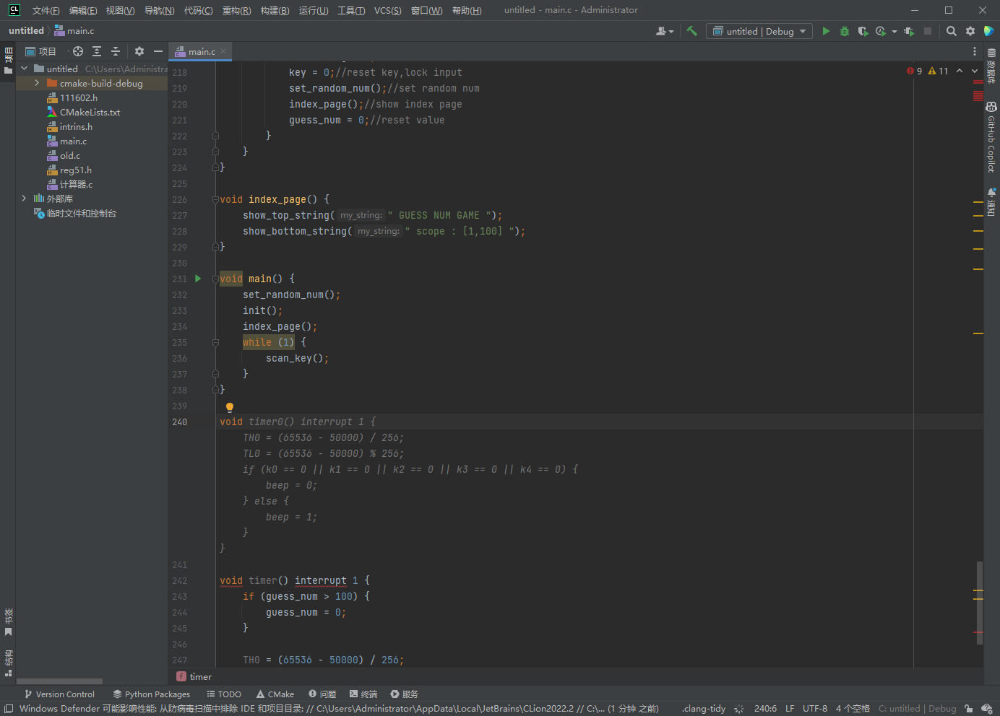


### 原理图:

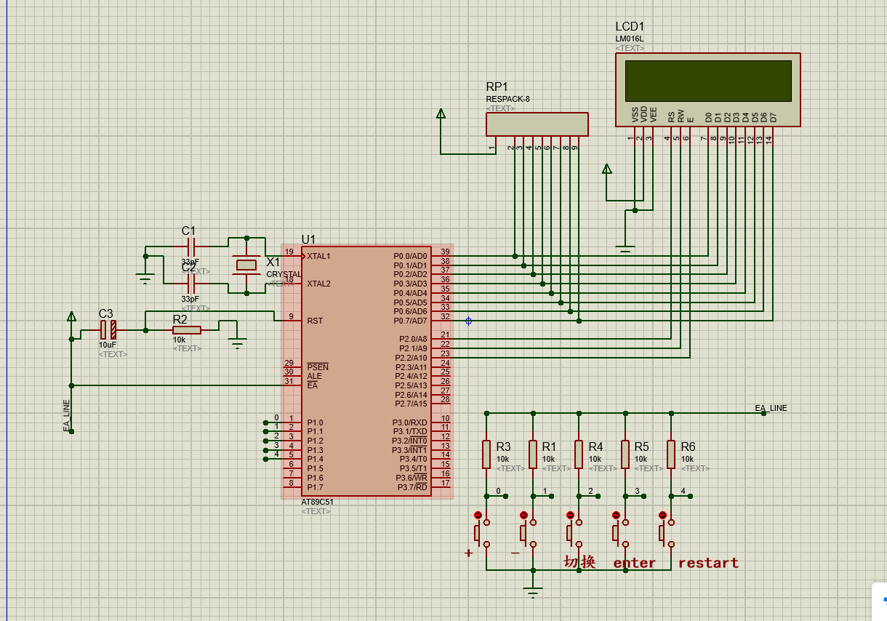


### 代码

简单的定义一下需要用到的东西:

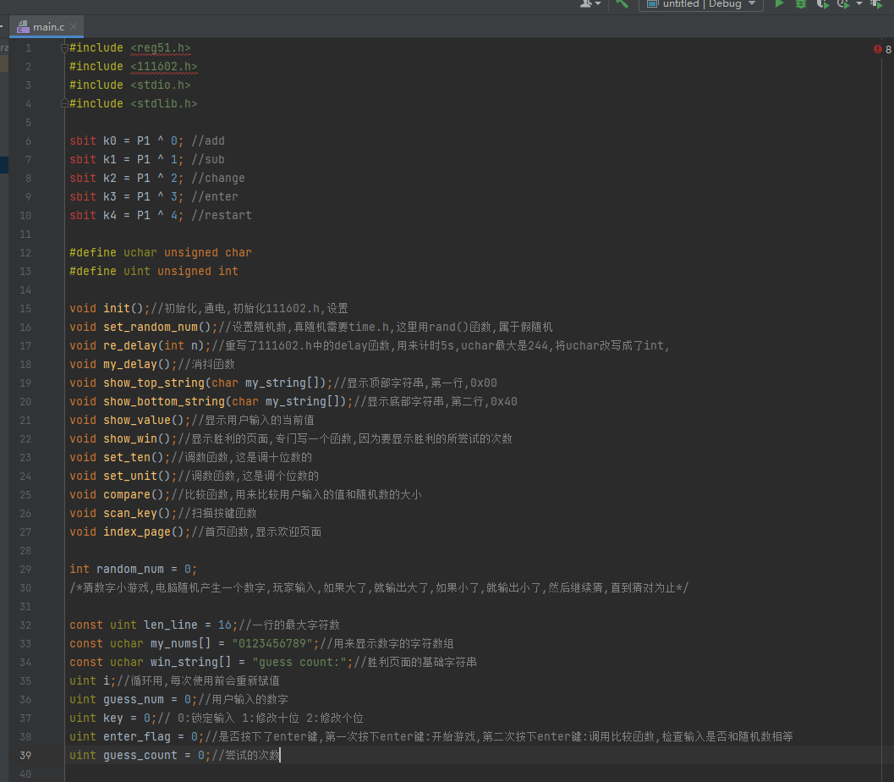

工具类:

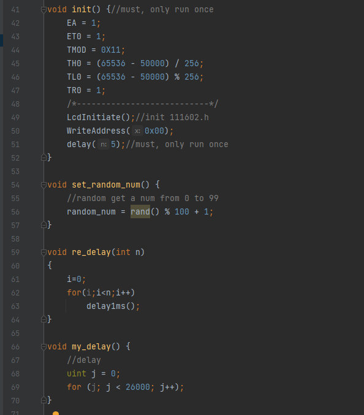

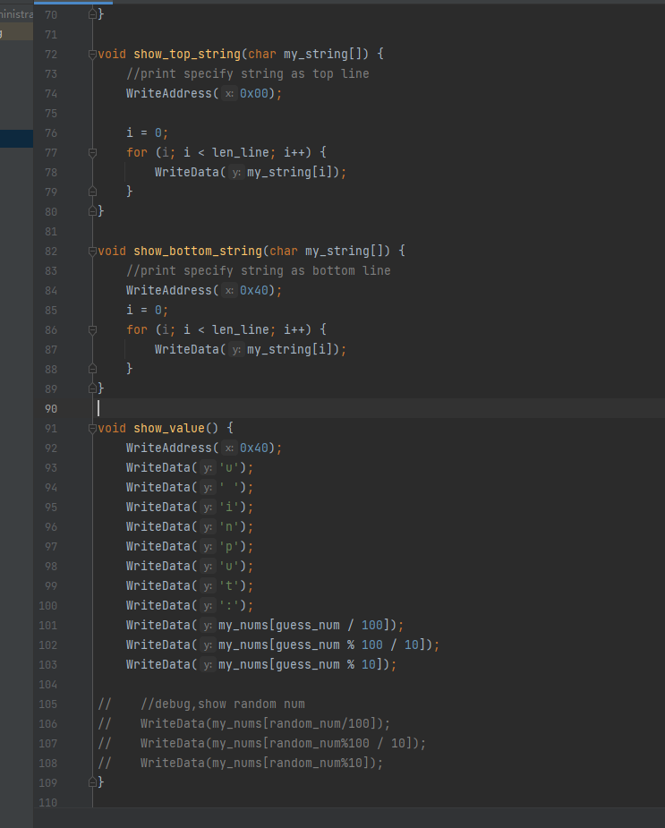

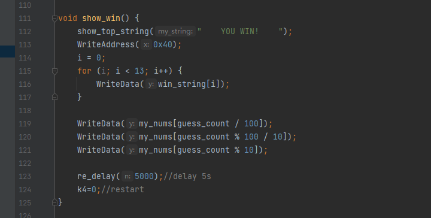

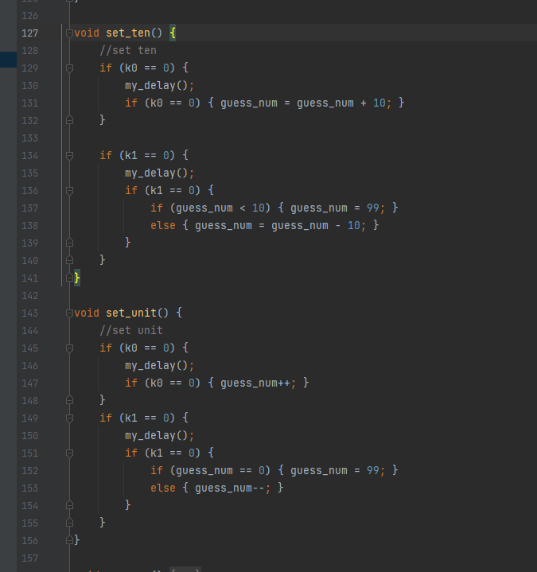

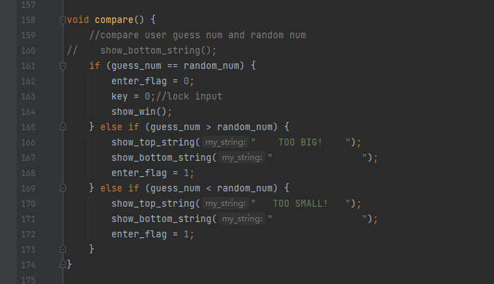

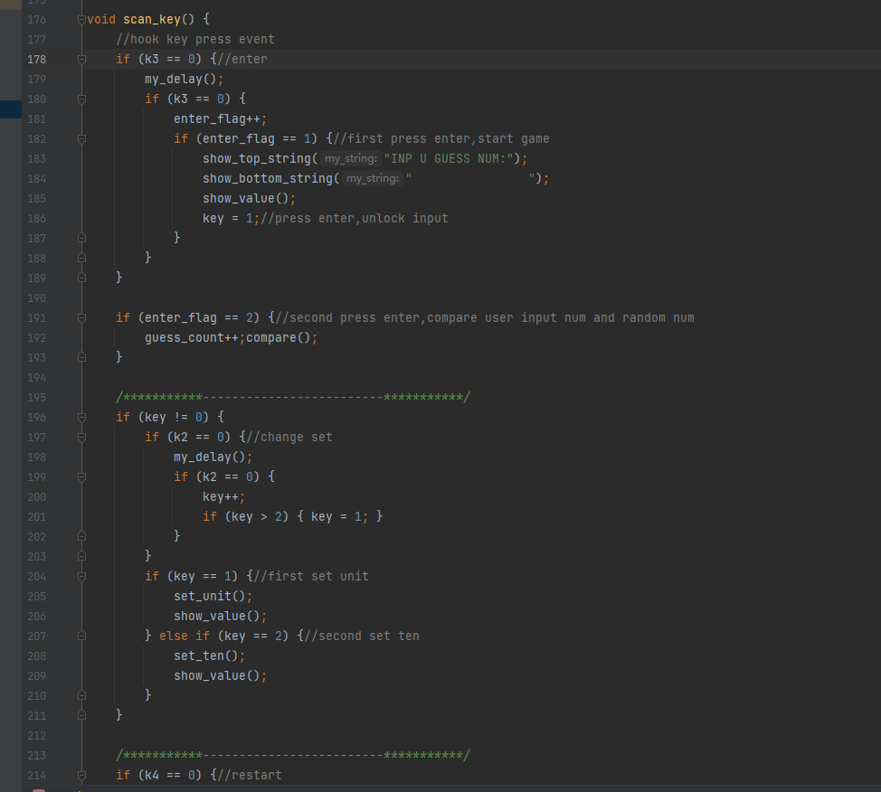

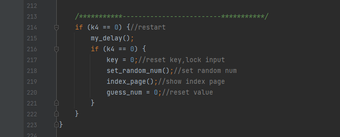

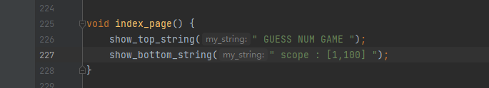

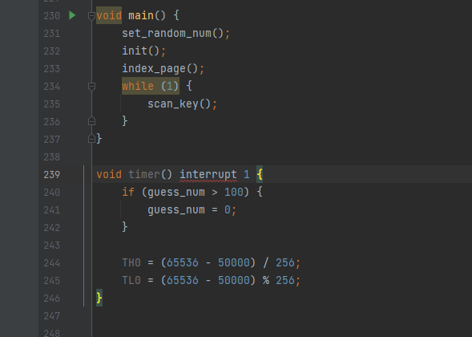

## 感想

一开始的想法很多,想过做井字棋,贪吃蛇,四则运算计算器,二八十十六进制转换器,但是嫌麻烦,最后选了一个猜数字的小游戏来做,总体实现起来没什么难度,偶尔出点小bug,也是因为加锁后忘记释放,有时候hex文件要跟dsn文件放到同一目录才能正常仿真,单片机debug的时候非常折磨人心态,所以初学还是适合做一个效果就编译仿真一次,单片机还是挺有意思的